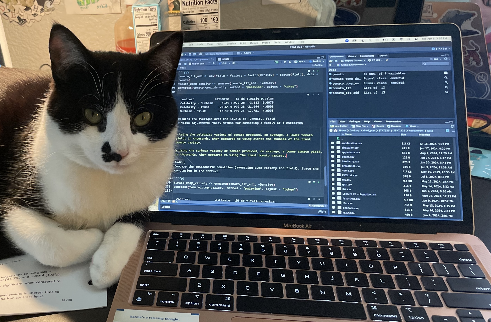

My name is Aiden Roach and I am studying biology, statistics, and environmental science at California State University of Monterey Bay. After undergraduate school, I want to go to graduate school for a Ph.D. in ecology or population biology. For my career, I want to study the migration patterns of large mammals to make urban development friendlier towards our animal neighbors. Whenever I have free time, I like to crochet and be with my cat Moose.

