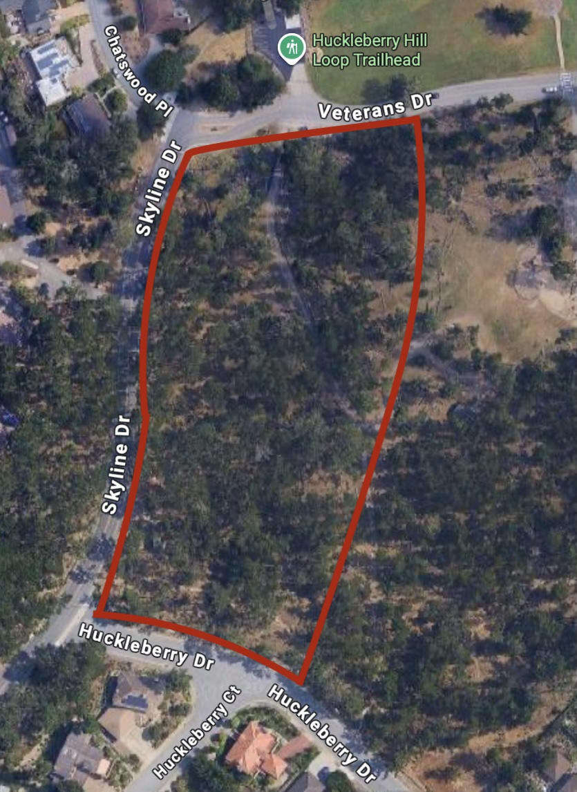
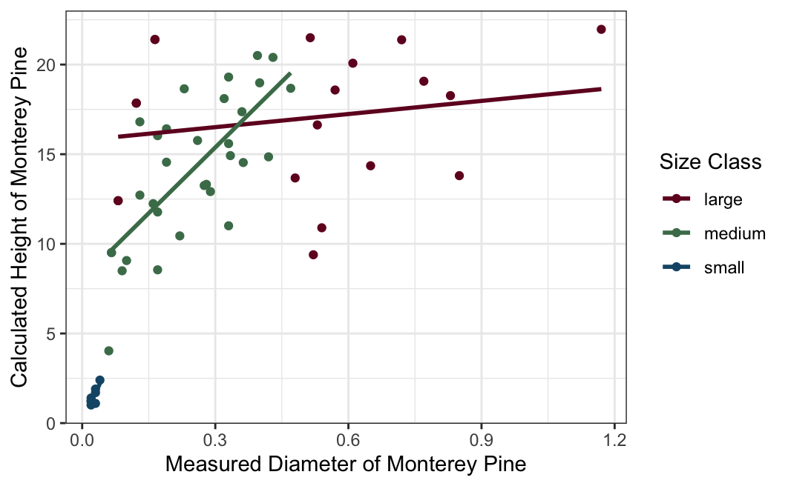
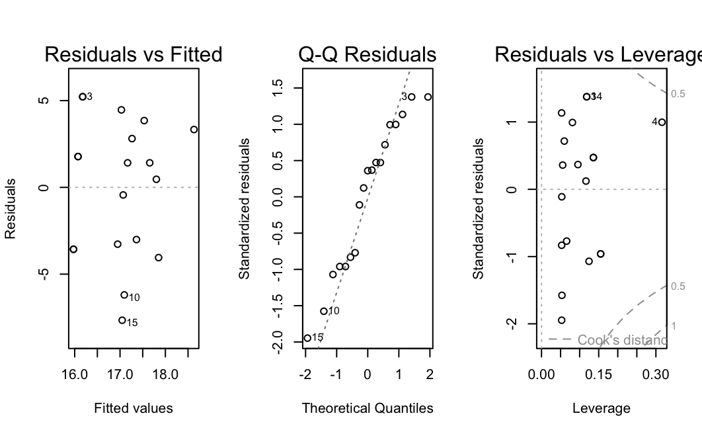
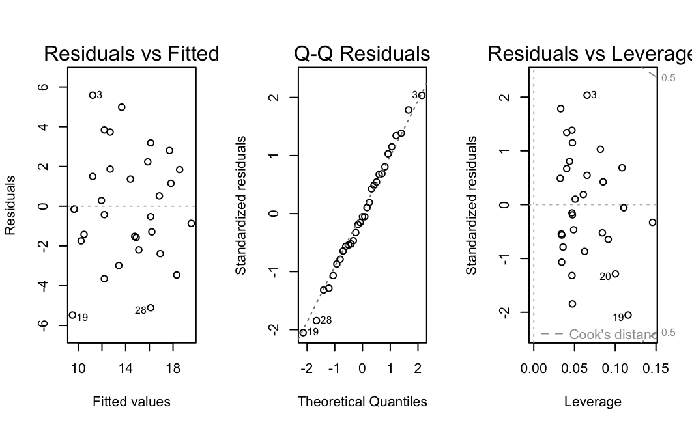
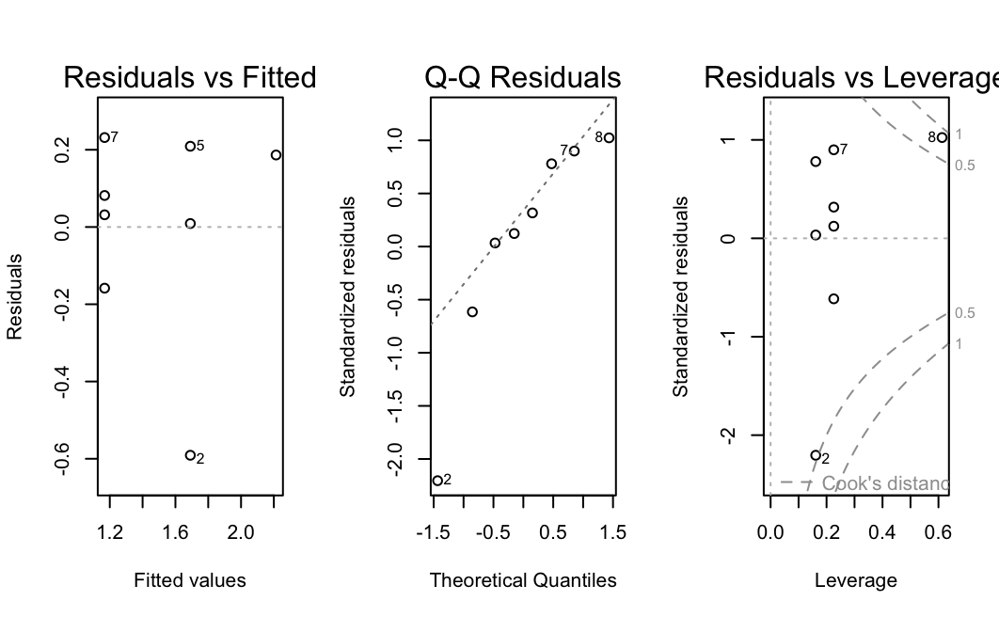

# Exploring the Relationship Between Measured Diameter and Estimated Height of *Pinus radiata* Based on Size Class

## Aiden Roach

# Introduction

### Background

Known for its rapid growth and useful lumber, Pinus radiata (Monterey pine) is the most planted pine in the world. The Monterey pine is found naturally in San Mateo, Santa Cruz, Monterey, and San Luis Obispo counties in California but has little demand within the United States of America besides its ornamental value. However the lumber holds value in international markets (McDonald and Laacke 1990). The purpose of this study is to explore the relationship between the measured diameter and the calculated height based on the size class of Monterey pine. If a strong relationship exists, growers would be able to save time and resources by just measuring the diameter of their trees to ensure a tree is large enough for sale rather than measuring the height of each tree.

# Methods

### Data Collection

The ENVS 350 class arrived at Veteran’s Park in Monterey, California at approximately 8:30am on October 2nd, 2025. Groups of four to five people were randomly assigned to plots within the study site which is defined in Figure 1. Each group mapped their plot using pencil and paper and noted each small, medium, and large tree before randomly selecting three to four trees for measurement in each size category. The three size categories were defined as a class to be based on a visual estimate of the tree size and are not based on any direct measurement. Once trees for each size category have been selected, the diameter of each tree is measured using a fabric diameter tape. The diameter of large trees was measured at 4.5 feet above ground, 25 centimeters above ground for medium trees, and 5 centimeters above ground for small trees. Additionally, the distance from the measurer and tree was recorded using a 50 meter transect tape. The measurer used a clinometer to record the up angle and the down angle off each tree. The distance, up angle, and down angle was used to later calculate the height of each tree in meters as described in Steiner M. and Baker J. 2018.

### Statistical Analysis

A scatterplot with the measured diameter plotted on the x-axis, the estimated heights plotted on the y-axis, and the size class of the Monterey pine represented by color will be generated using the ggplot package in R. A linear model will be created for each size class using the lm function from base R. Graphics exploring the assumptions for each linear model will be created using the plot function which is also included in base R. Finally, a power analysis of each linear model will be calculated using the pwr.f2.test in the pwr package. The effect size for each power test will be calculated using the equation established in Cohen 1988: $f2 = R^2/ 1-R^2$

# Results

### Exploratory Data Analysis

Multiple transformations were considered, but ultimately no transformation was chosen for the high correlation values. A table of each transformation and their correlations can be found in Table 1. A scatterplot of measured diameter, calculated height, and size class can be found in Figure 2. Looking at the scatterplot, there is a lot of variation in the large size class. This is supported by the $R^2$ value of 0.03532 which means only 3.532% of the variation can be explained by the model of calculated height and measured diameter of large Monterey pine. However there is less variation for the small and medium size classes. This is supported by the $R^2$ values of 0.673 for the small size class and 0.5234 for the medium size class. This means 67.3% of the variation can be explained by the model of calculated height and measured diameter of small Monterey pine and 52.34% of the variation can be explained by the model of calculated height and measured diameter of medium Monterey pine.

### Hypothesis Testing

Each linear model based on size class produced varying results. We found very little evidence against our null hypothesis that there is no relationship between the estimated height and the calculated diameter when the Monterey pine is considered large (t = 0.789, df = 17, α = 0.05, p-value = 0.441). We found very strong evidence against our null hypothesis that there is no relationship between the estimated height and the calculated diameter when the Monterey pine is considered medium (t = 5.643, df = 29, α = 0.05, p-value = 4.26e-6). We found moderately strong evidence against our null hypothesis that there is no relationship between the estimated height and the calculated diameter when the Monterey pine is considered small (t = 3.514, df = 6, α = 0.05, p-value = 0.0126). The test statistics, R2, degrees of freedom, p-values, and powers of each test are presented in Table 2 for an alternative view.

We are able to trust the results of the large size class model because we have met the necessary assumptions. When looking at the residuals vs fitted plot in Figure 3, there is an even distribution of the residuals around zero with no definable pattern. This implies that a linear model can be used to describe the relationship between the measured diameter and the calculated height of large Monterey pine, the residuals in the large size class linear model have equal variance, and the residuals in the large size class linear model are independent of each other. Additionally there are no points of concern because no residual has a Cook’s distance larger than 0.5 as shown in the Cook’s distance plot in Figure 3. Finally, we have met the normality assumption based on the Q-Q plot shown in Figure 3. There is some slight deviation at the tails, but this deviation can be explained by the sample size of 19. Since the residuals mostly follow the 1:1 line, we can conclude that the residuals increase at the expected cumulative frequency rate and the normality assumption has been met.

We are able to trust the results of the medium size class model because we have met the necessary conditions. When looking at the residuals vs fitted plot in Figure 4, there is an even distribution of the residuals around zero with a slight fanning pattern which can be explained by our sample size of 31. The overall lack of a clear pattern implies that a linear model can be used to describe the relationship between the measured diameter and the calculated height of medium Monterey pine, the residuals in the medium size class linear model have equal variance, and the residuals in the medium size class linear model are independent of each other. Additionally there are no points of concern because no residual has a Cook’s distance larger than 0.5 as shown in the Cook’s distance plot in Figure 4. Finally, we have met the normality assumption based on the Q-Q plot shown in Figure 4. The residuals closely follow the 1:1 line even though we have a relatively small sample size of 31. Since the residuals follow the 1:1 line, we can conclude that the residuals increase at the expected cumulative frequency rate and the normality assumption has been met.

We are unable to trust the results of the small size class model because we have not met the necessary conditions. When looking at the residuals vs fitted plot in Figure 5, there is an uneven distribution of the residuals around zero with three distinct columns visible. This pattern implies that a linear model can not be used to describe the relationship between the measured diameter and the calculated height of small Monterey pine, the residuals in the small size class linear model do not have equal variance, and the residuals in the small size class linear model are not independent of each other. Additionally there is one possible point of concern with a residual having a Cook’s distance greater than 0.5 shown in the Cook’s distance plot in Figure 5. However since the Cook’s distance of that residual is less than 1 it is likely not a major point of influence. Finally, we have not met the normality assumption based on the Q-Q plot shown in Figure 5. There is major deviation at the left tail, but this deviation can be explained by the sample size of 6. Since the residuals do not follow the 1:1 line, we can conclude that the residuals do not increase at the expected cumulative frequency rate and the normality assumption has not been met.

# Discussion

The differences in results between all three class sizes were quite surprising. Given our small sample sizes for the large size class and the small size class, further studies could collect more data on large and small Monterey pine to see if the pattern we observed remains constant or if we simply lacked a robust dataset. With a larger sample size, there is also the possibility of increasing the power for the large size class linear model. Interestingly, we had collected large enough sample sizes for the medium and small size classes to maintain sufficient power for those linear models. If given the resources, another future study could compare the relationship between measured diameter and calculated height given size class to the relationship between measured diameter and measured height given size class. If using estimated heights produces similar results to the measured heights of trees, future studies would be able to avoid using time and money on measuring the height of each tree of interest.

# Figures and Tables

### Table 1. Correlation values of each transformation given size class.

| Size Class | No Transformation | Square-root Transformation | Logarithmic Transformation |
|----------------|----------------|---------------------|---------------------|
| Large | 0.1879371 | 0.1583630 | 0.1436199 |
| Medium | 0.7234398 | 0.7417704 | 0.7567372 |
| Small | 0.8203660 | 0.7909147 | 0.7599737 |

### Table 2. Results of each linear model

| Size Class | R2 | Test Statistic (t) | Degrees of freedom | P-value | Power |
|------------|------------|------------|------------|------------|------------|
| Large | 0.03532 | 0.789 | 17 | 0.44 | 0.1235547 |
| Medium | 0.5234 | 5.643 | 29 | $4.26e^{-6}$ | 0.9998802 |
| Small | 0.673 | 3.514 | 6 | 0.0126 | 0.9189292 |

# References

References Cohen J. 1988. Statistical power analysis for the behavioral sciences. 2nd ed. Hillsdale, N.J.: Lawrence Erlbaum Associates.

McDonald P. and Laacke R. 1990. Pinus radiata D. wwwsrsfsusdagov. https://www.srs.fs.usda.gov/pubs/misc/ag_654/volume_1/pinus/radiata.htm.

Steiner M. and Baker J. 2018. Measuring Tree Height using a Clinometer \| NRI Grazing Land. grazinglandcssmiastateedu. https://grazingland.cssm.iastate.edu/measuring-tree-height-using-clinometer.
