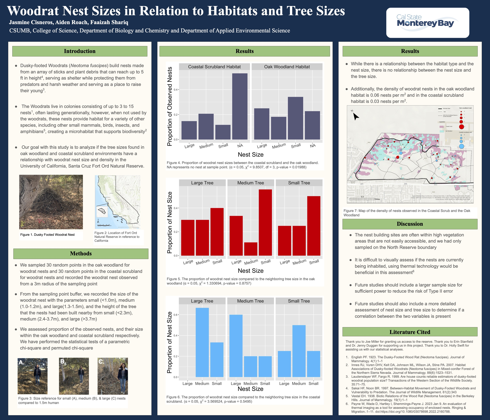
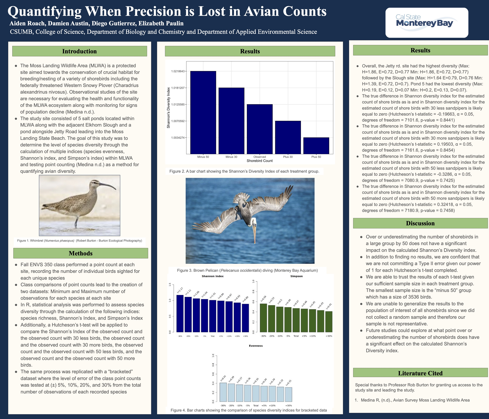

## Woodrat Nest Sizes in Relation to Habitats and Tree Sizes

My team and I created this poster for our Ecology class as part of our lab final. We were also fortunate enough to present the poster as guests for the Department of Applied Environmental Science Fall 2024 Capstone Festival at our university!

## Quantifying When Precision is Lost in Avian Counts

My team and I created this poster for our Quantitative Field Methods course. The professor allowed us to expand on the original assignment and we taught ourselves how to preform the Hutcheson's T-test for ecological studies.

